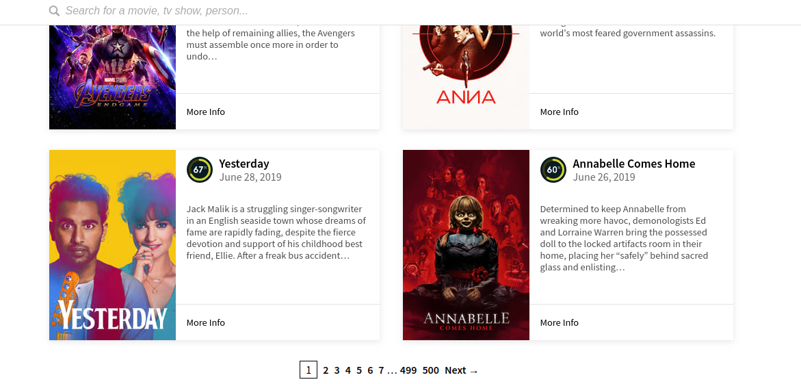
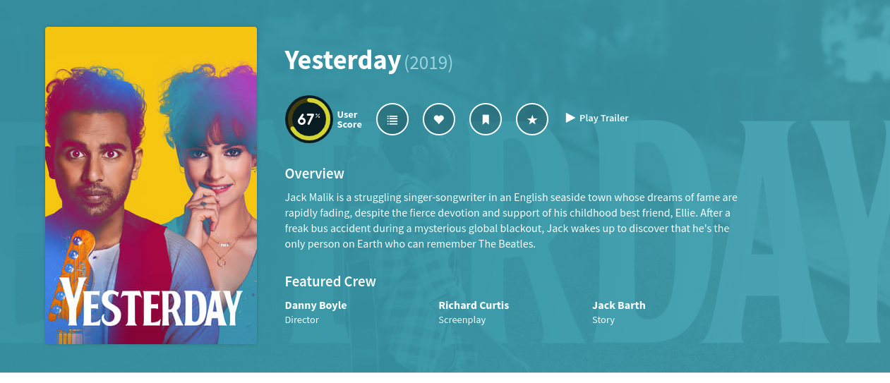

# Movies Web App

__Objective__: use [The Movie Database API -v3](https://developers.themoviedb.org/) to create a movie directory app using angular.

## Tasks

1. Create a home page that shows upcoming movies
2. Add a movie details page
3. add favourite functionality which allows you to favourite a movie
4. create a separate page which allows you to see all the movies you’ve favourited.
5. Add a search bar, which allows users to search for movies
6. Write unit tests for your components & services

No user login/authentication is required. You are also not required to create any backend solution.
There is no restriction on how your app should look like. How the app is designed and styled is upto to you.

Solving these problems one step at a time will help you feel less overwhelmed and more like you’re heading in a specific direction.

## Tech Stack

1. Angular - use Angular CLI to generate your app
2. CSS Sytling. You can use [bootstrap](https://getbootstrap.com/), [Angular Material](https://material.angular.io/) or any other css framework.

## API Access

You are required to create an account [here](https://www.themoviedb.org) before you can access The Movie DB API.
Check the [Getting Started Guide](https://www.themoviedb.org/documentation/api) for more details.
After getting an API key, the following documentation pages can be a good place to start.

- https://www.themoviedb.org/documentation/api - Overview
- https://developers.themoviedb.org/3/configuration/get-api-configuration - Base Url
- https://www.themoviedb.org/documentation/api/discover - Movie Discover
- https://developers.themoviedb.org/3/discover/movie-discover - Movie Discover
- https://developers.themoviedb.org/3/getting-started/images - Loading Images

These images show how your app might look like. It's not a requirement that your app should have the same styling as is shown in the images below.
The only requirements are the ones listed in the task list above.

_Home Page_

_Details Page_

